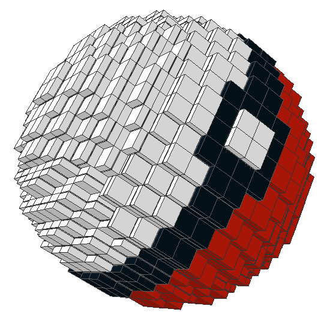
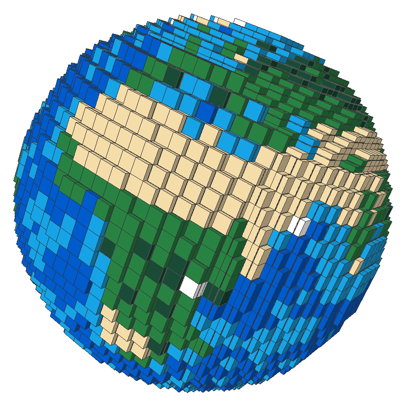
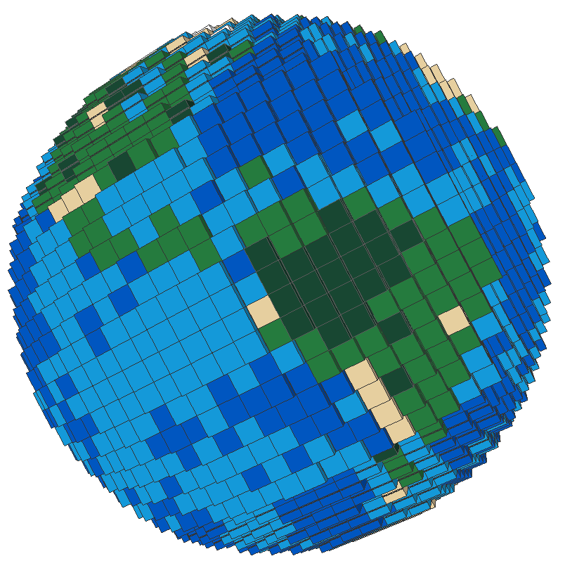
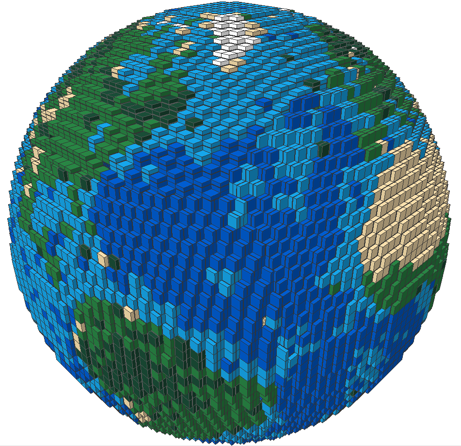

# Loenan Bricks

> Generate the Earth, spheres and other models in Lego, at any size ! 

Loenan Bricks libraries provide Java tools to compute and generate Lego models [in LDraw format](http://www.ldraw.org/), 
such as spheres with various color scheme, in any size. 

- **LDraw Builder** library is a simple low level library to build and write Lego models in LDraw format.
- **Brick Sphere** library is a generator of brick-built sphere models in any size, with the color scheme of your choice.
Such a sphere looks like a mosaic computed on the sphere surface.

Some color schemes are provided to compute the colors on generated spheres:
- from (X,Y,Z) coordinates,
- from (longitude, latitude) coordinates,
- or from an image resource, using an [equirectangular projection](https://en.wikipedia.org/wiki/Equirectangular_projection).

You can easily add yours!

## Samples

### Pokeball



Source file: [LoenanSphere-pokeball-D15.0-C8.mpd](doc/LoenanSphere-pokeball-D15.0-C8.mpd)

### Earth

Diameter &#x2300;28:

 


Source file: [LoenanSphere-earth-D28.0-C16.mpd](doc/LoenanSphere-earth-D28.0-C16.mpd) 

Diameter &#x2300;50:



Credits:

- Generated using `Large_World_Topo_Map_2.png` image from https://commons.wikimedia.org/wiki/File:Large_World_Topo_Map_2.png
  (Creative Commons license)


## Modules

Name                                             | Comments
------------------------------------------------ | ------------------
[ldraw-builder](ldraw-builder)                   | A simple LDraw model builder and writer library
[brick-sphere-generator](brick-sphere-generator) | Core library to generate spheres
[brick-sphere-app](brick-sphere-app)             | Web Application to run the Brick Sphere Generator

## Getting started

Requirements: 
- Install [Java 8+ runtime](http://www.oracle.com/technetwork/java/javase/downloads/jdk8-downloads-2133151.html) 
- Install [Apache Maven 3+](https://maven.apache.org/download.cgi)
- Install [LDraw tools](http://www.ldraw.org/help/getting-started.html) (at least LDview, the viewer)

Build the project:
```
mvn clean install
```

Run the Web application (replace `XXX` with the application version):

```
cd brick-sphere-app/target/
java -jar brick-sphere-app-XXX.jar
```

Generate a sphere: Open a Web browser with an URL such as:

```
http://localhost:8080/pokeball/15
```

The URL format is `http://localhost:8080/<color scheme>/<diameter>`. 

Example color schemes:
- `earth`
- `pokeball`
- `faces`
- `longitude`
- `latitude`
